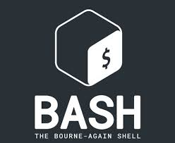

# Bash Shell Scripting

### Bash
* Bash is a command language interpreter. It is widely available on various operating systems and is a default command interpreter on most GNU/Linux systems. The name is an acronym for the ‘Bourne-Again SHell’.

### Shell
* Shell is a macro processor which allows for an interactive or non-interactive command execution.

### Scripting
* Scripting allows for an automatic commands execution that would otherwise be executed interactively one-by-one.
 

Bash scripts are used by Systems Administrators, Programmers, Network Engineers, Scientists and just about anyone else who uses a Linux/ Unix system regularly. No matter what you do or what your general level of computer proficiency is, you can generally find a way to use Bash scripting to make your life easier. Bash is a command line language. The name stands for Bourne Again SHell. It is an open source version of the Bourne Shell and was first released in 1989.

### Good Tutorial Link
* [Linux config](https://linuxconfig.org/bash-scripting-tutorial-for-beginners)
* [Linux Hint](https://linuxhint.com/bash_scripting_tutorial_beginners/)
* [Ryans Tutorial](https://ryanstutorials.net/bash-scripting-tutorial/)
* [Tutorials Point](https://www.tutorialspoint.com/unix/shell_scripting.htm)
* [Shell Script](https://www.shellscript.sh/)

